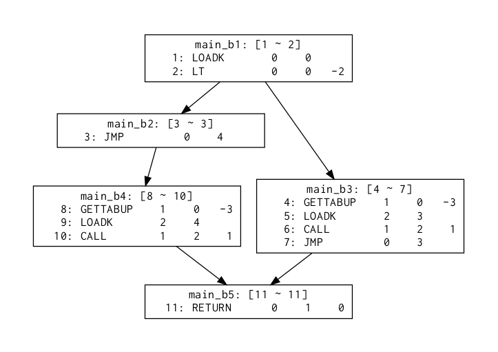

Opeth
===

Opeth is the optimizer and debug tools for [Lua](https://lua.org) VM bytecode, or [Metal band](http://www.opeth.com/).

# tools
## opeth
Lua VM Bytecode optimizer

### install
```
luarocks --local install opeth-opeth
```
### usage

```
Usage: opeth [-o <output>] [-V] [-T] [-v] [--show-optimizations] [-h]
       <input> [-x index [index] ...]

Lua VM Bytecode Optimizer

Arguments:
   input                 luac file

Options:
   -o <output>, --output <output>
                         output file (default: optimized.out)
   -x index [index] ..., --disable-optimize index [index] ...
                         disable a part of optimizer
   -V, --verbose         verbose optimization process
   -T, --time            measure the time
   -v, --version         version information
   --show-optimizations  show a sort of otimization
   -h, --help            Show this help message and exit.
```

#### example
```
$ # Show the optimization techniques. The order corrensponds to the index which needs to `--disable-optimize` option.
$ opeth --show-optimizations
unreachable blocks removal : remove all the blocks which are unreachable for the top
constant fold              : evaluate some operations beforehand
constant propagation       : replace `MOVE` instruction with the another
dead-code elimination      : eliminate the instructions which aren't needed
function inlining          : expand a funcion call with the function's instructions
$
$ opeth luac.out -o optimized.out
$
$ opeth luac.out -o optimized.out --verbose --time
read from luac.out (size: 226 byte, time: 0.79703330993652 msec)
unreachable blocks removal#main: 0 modified
constant fold#main: 0 modified
constant propagation#main: 0 modified
dead-code elimination#main: 2 modified
unreachable blocks removal#main: 3 modified
constant fold#main: 0 modified
constant propagation#main: 0 modified
dead-code elimination#main: 1 modified
unreachable blocks removal#main: 0 modified
constant fold#main: 0 modified
constant propagation#main: 1 modified
dead-code elimination#main: 0 modified
unreachable blocks removal#main: 0 modified
constant fold#main: 0 modified
constant propagation#main: 0 modified
dead-code elimination#main: 0 modified
unused resources removal#main: 3 modified
(optimize time: 3.058910369873 msec)
change of the number of instructions: 11 -> 5

write to optimized.out (size: 110 byte, time: 0.25796890258789 msec)
$
$ # optimize without the op-technique which the index points to.
$ opeth luac.out -o optimized.out --verbose --time --disable-optimize 1
read from luac.out (size: 226 byte, time: 0.7932186126709 msec)
constant fold#main: 0 modified
constant propagation#main: 0 modified
dead-code elimination#main: 2 modified
constant fold#main: 0 modified
constant propagation#main: 0 modified
dead-code elimination#main: 1 modified
constant fold#main: 0 modified
constant propagation#main: 1 modified
dead-code elimination#main: 0 modified
constant fold#main: 0 modified
constant propagation#main: 0 modified
dead-code elimination#main: 0 modified
unused resources removal#main: 2 modified
(optimize time: 3.7388801574707 msec)
change of the number of instructions: 11 -> 8

write to optimized.out (size: 129 byte, time: 0.32711029052734 msec)
```

### optimize functions inscripts
you can use the optimizer in your scripts.
```moon
optimizer = require'opeth.opeth'

f = -> ......
f_ = optimizer f
f_!
```

## lvis
Lua VM Bytecode Control Flow Graph Visualizer
### install
```
luarocks --local install opeth-lvis
```

### usage
#### example
Supporse think about the lua code and following bytecode.
```lua
local x = 3

if x < 5 then
	print("hello")
else
	print("world")
end
```

```
        1       [1]     LOADK           0 -1    ; 3
        2       [3]     LT              0 0 -2  ; - 5
        3       [3]     JMP             0 4     ; to 8
        4       [4]     GETTABUP        1 0 -3  ; _ENV "print"
        5       [4]     LOADK           2 -4    ; "hello"
        6       [4]     CALL            1 2 1
        7       [4]     JMP             0 3     ; to 11
        8       [6]     GETTABUP        1 0 -3  ; _ENV "print"
        9       [6]     LOADK           2 -5    ; "world"
        10      [6]     CALL            1 2 1
        11      [7]     RETURN          0 1
```

Given a bytecode,
```
$ lvis luac.out
```
lvis outputs the pdf



## moonstep
Lua VM Bytecode step-by-step execution machine
### install
```
luarocks --local install opeth-moonstep
```

### usage
#### commands in dialogue
```
command:
        bp <pc>: set a breakpoint to <pc>
        r: run the code. if the breakpoint is set, stop at <pc>
        n: execute the next instruction
        d: dump the current register and PC
        dp: dump the bytecode structure
        q: quit
```

## lasmc
**L**ua VM Bytecode **As**se**m**bly-like Language **C**ompiler
### install
```
luarocks --local install opeth-lasm
```

### syntax
......

# dependencies
- [MoonScript](https://moonscript.org)
- [luasocket](http://w3.impa.br/~diego/software/luasocket/)
- [argparse](http://mpeterv.github.io/argparse/)
- [lua-graphviz](https://github.com/Nymphium/lua-graphviz)
- [inspect.lua](https://github.com/kikito/inspect.lua)

# reference
https://nymphium.github.io/pdf/opeth_report.pdf

# LICENSE
[MIT](https://opensource.org/licenses/MIT)

